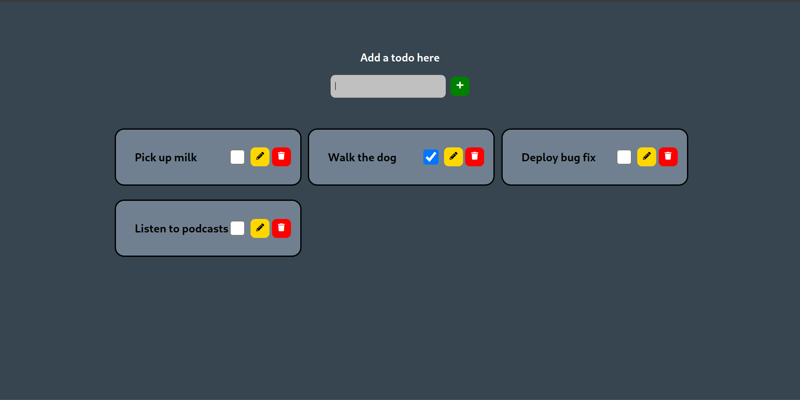

# The Humble ToDo App

This is my ToDo app. There are many like it, but this one is mine.
I'm using this app as a stepping stone toward a few more sophisticated apps such as Trello clones and bug trackers.



## Clone the Repo

```bash
$ git clone https://github.com/aaronrine/todo-list.git
$ cd todo-list
```

## Develop Locally

```bash
$ yarn install
$ yarn start
```

## Deploy With Docker

```bash
$ docker build -t todo .
$ docker run -d --name todo -p 8080:80 todo
```
